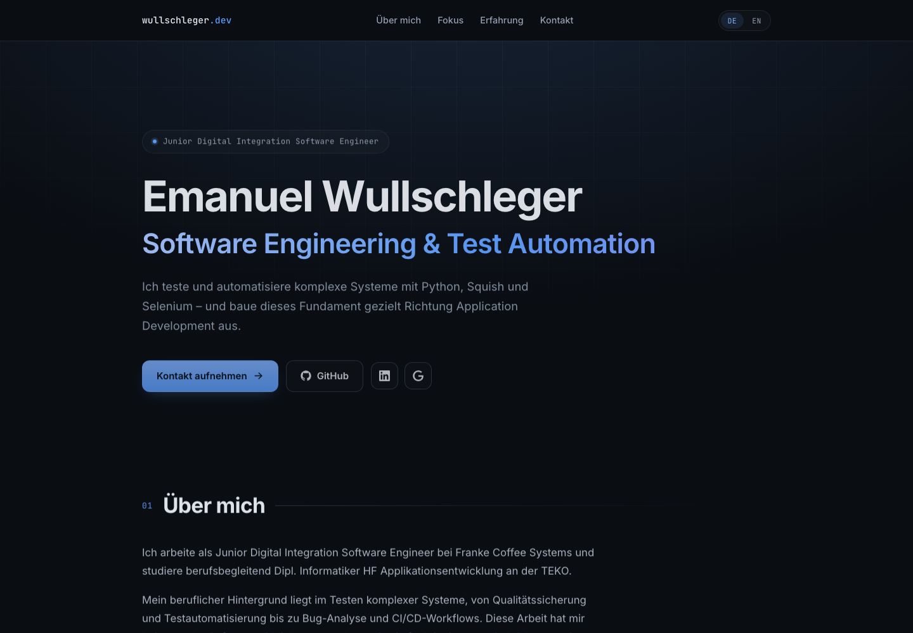

# wullschleger.dev

Personal portfolio of **Emanuel Wullschleger** — Junior Digital Integration Software Engineer with a background in software testing and test automation (Python, Squish, Selenium, Jenkins), currently studying application development (Dipl. Informatiker HF) and growing towards software engineering.

**→ Live site: [wullschleger.dev](https://wullschleger.dev)**



## About this site

Deliberately small — no template, no UI library, no CSS framework.

- **React + Vite**, fully static, hosted on Cloudflare Pages
- **Custom CSS** on a small design-token system (colors, spacing, radii, shadows) in a single stylesheet
- **Bilingual** — German (default) and English, with all copy in one translations file
- **Subtle motion** — CSS entrance animation and IntersectionObserver scroll reveals, disabled for `prefers-reduced-motion`
- **Accessibility basics** — semantic HTML, skip link, visible focus states, ARIA labels

## Structure

```
wullschleger-dev/
├── index.html           meta / OG tags, fonts
└── src/
    ├── translations.js  all visible text (DE + EN)
    ├── styles.css       design tokens + all styling
    └── components/      one React component per section
```

## Contact

The best way to reach me is through the [contact section on the site](https://wullschleger.dev/#contact), or on [LinkedIn](https://www.linkedin.com/in/emanuel-wullschleger/).
